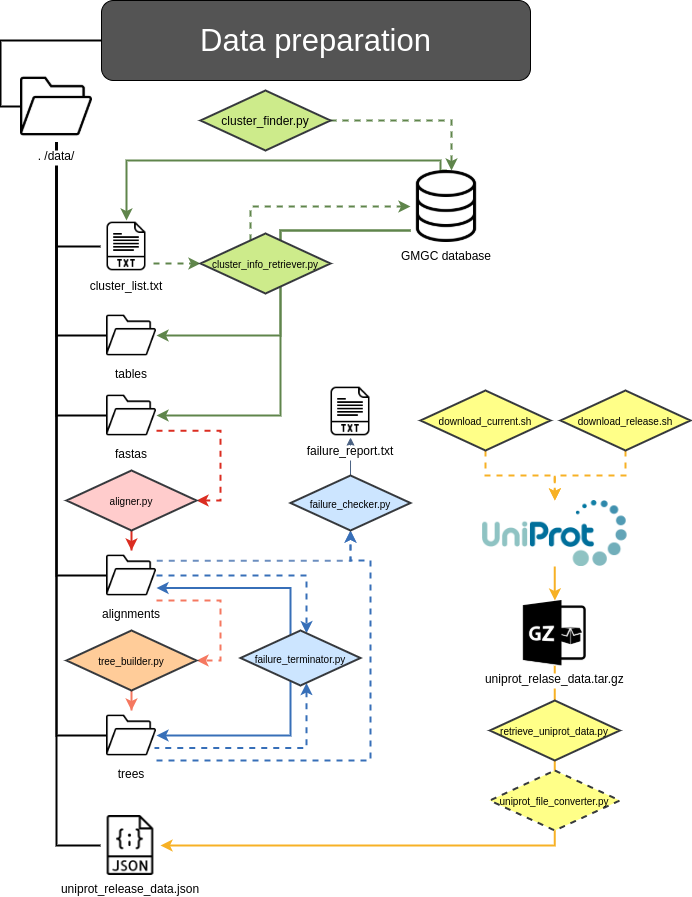

# In this repository we will find all the scripts regarding the preparation of the data that we will use for the consecution of this final master's project.

### data
Folder that contains all the results from executing the scripts from the different folders.

### cluster_info_finder  
Folder that contains multiple algorithms to extract data from our MongoDB, as well as the information retrieved stored in different files.

### multiple_aligner  
Folder that contains algorithms to carry out multiple alignments from our <fasta>.fas files.
  
### tree_builder 
Folder that contains algorithms to carry out phylogenetic tree building from our <alignment>.fas.alg files.
  
### failure_handler 
Folder that contains algorithms to check that our other scripts had a correct functioning, and diverse functionalities such as removing corrupted files or making reports about them.

### swissprot_parser  
Folder that contains algorithms to download a specified swissprot data file, and create a JSON file with the annotations that It contains for each entry.

